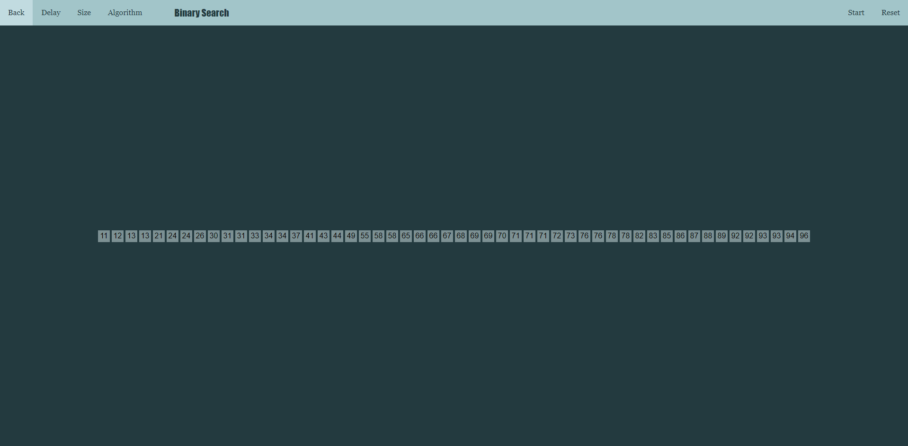
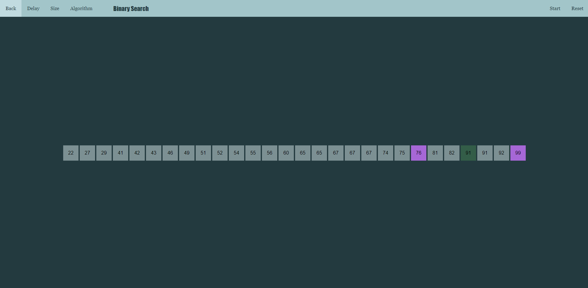
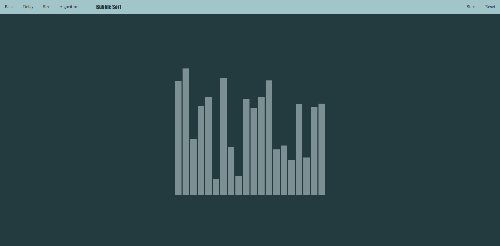
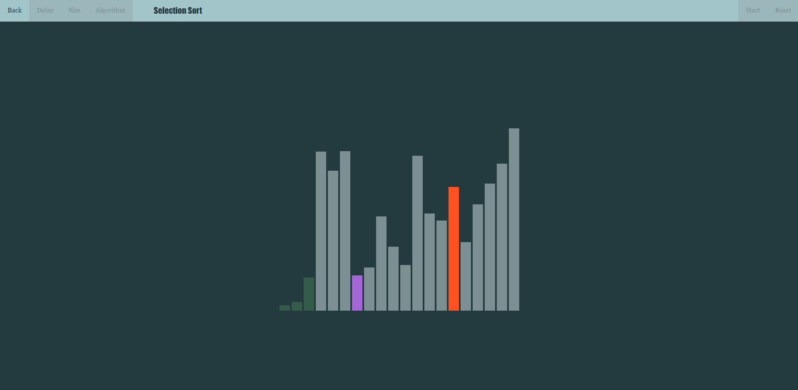
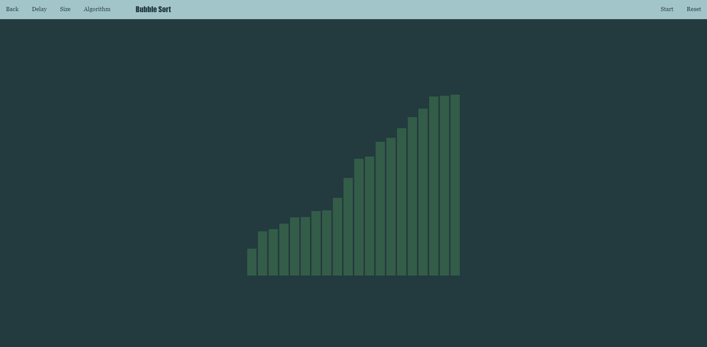
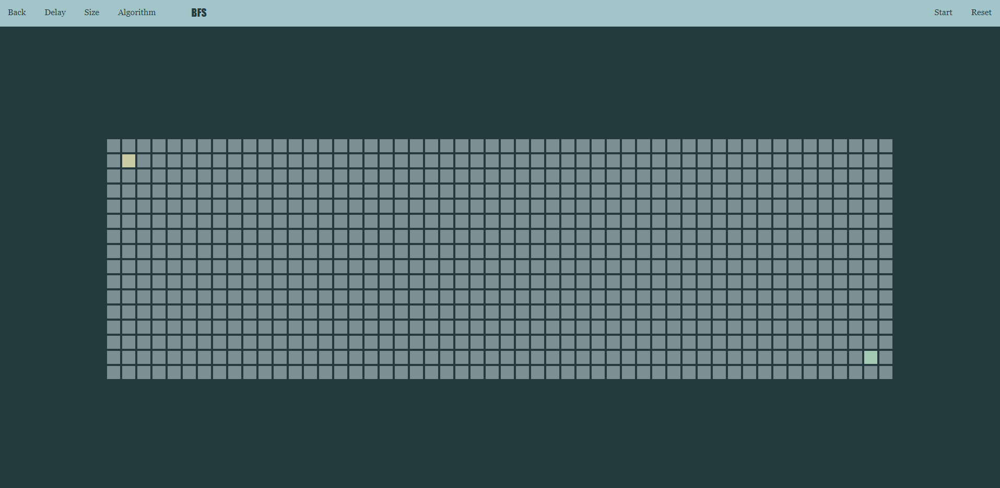
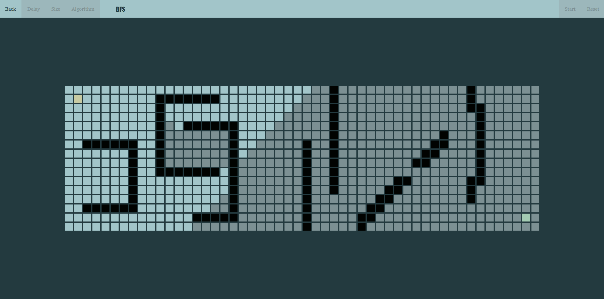
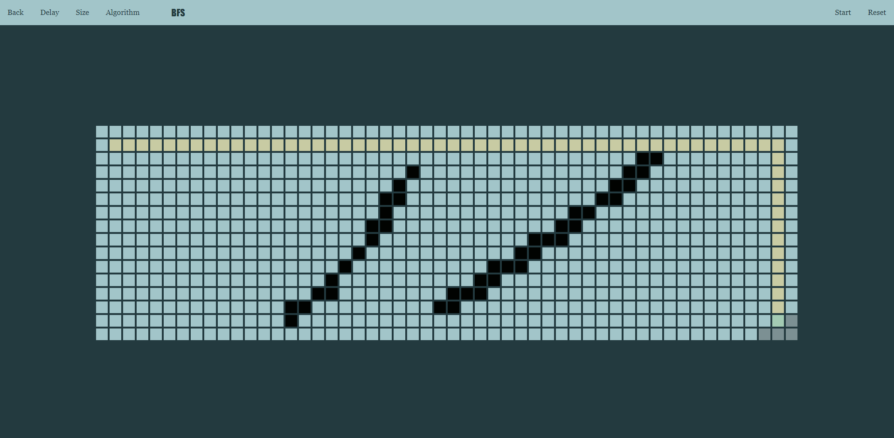

# Algorithm Visualizer

An educational tool for visualizing and exploring classic algorithms across searching, sorting, and pathfinding — built with Angular, TypeScript, and Nx as part of my BSc thesis project.


---

## Tech Stack

| Tool | Purpose |
|---|---|
| Angular | UI framework |
| TypeScript | Language |
| Nx Workspace | Monorepo tooling |
| Node.js | Runtime |

---

## Getting Started

**Prerequisites:** Node.js v18+ and npm installed.

```bash
# 1. Clone the repository
git clone https://github.com/your-username/algorithm-visualizer.git
cd algorithm-visualizer

# 2. Install dependencies
npm install

# 3. Start the development server
nx serve algorithm-visualizer
```

The app will be available at `http://localhost:4200`.

> For other Nx commands (build, lint, test), refer to the [Nx CLI docs](https://nx.dev/reference/nx-commands).

---

## Architecture

Each algorithm category (searching, sorting, pathfinding) follows the same core pattern:

1. **State layer** — an array of typed objects representing visualization elements, each carrying properties like `size` and `color`.
2. **Component layer** — Angular components that map 1:1 to those objects, receiving values via `@Input()` bindings.
3. **Render layer** — components are rendered in the DOM, reflecting state changes as animations.

Animations are generated within each algorithm's execution block and driven by delayed code execution, allowing the UI to reflect intermediate algorithm states step by step.

---

## Demo

### Home
The home page presents three algorithm categories. Selecting one navigates to its dedicated visualization page.


### Searching
The array is displayed as a set of indexed elements. The active search range and target element are highlighted at each step.




### Sorting
Elements are represented as bars. The algorithm reorders them in real time, with comparisons and swaps highlighted as they happen.





### Pathfinding
A grid is rendered with configurable obstacles. The algorithm explores the grid and highlights the discovered path once found.




