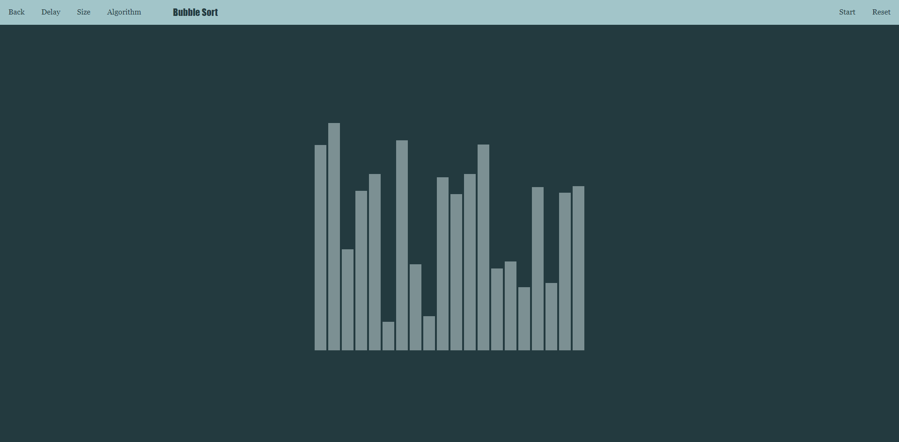

# Algorithm Visualizer

The goal of this project was to develop an application for a wide range of users within the educational system that would use algorithm visualization to assist them in learning, understanding, observing, and even teaching.

## Tools and Pre-requisites

* WebStorm (or any preferred editor)
* Node.js
* Typescript
* Nx Workspace
* Angular CLI
  
* npm install will create node modules
* nx serve algorithm-visualizer will start the application
* consult Nx CLI for other commands

## Architecture
The application contains 3 main sections for algorithm visualization: searching, sorting and pathfinding. All follow almost identical mechanisms when it comes to structure, performance and mechanics. Behind the scenes, there are arrays of user-defined objects which represent elements of the visualization. Those objects have specific properties such as size or color. 
There is a direct mapping between those classes and the components in the way that they share identical properties. Using Angular @Input the array of objects gives the values for the components used for display. Finally those components are rendered in the DOM. The animations are created within each algorithm's block of code and are handled using delayed code execution methods. 

#### Searching    
 
#### Sorting
 
#### Pathfinding
 

## Demo
This is the home page of the application. The user can select click one button in order to move to a specific category of algorithms.
  
After selection, the user is moved to an algorithm visualization page which allows for configuration.
 
#### Searching
  
 
#### Sorting
  
  
 
#### Pathfinding
  
  
 
